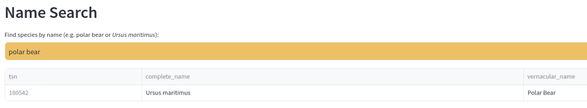
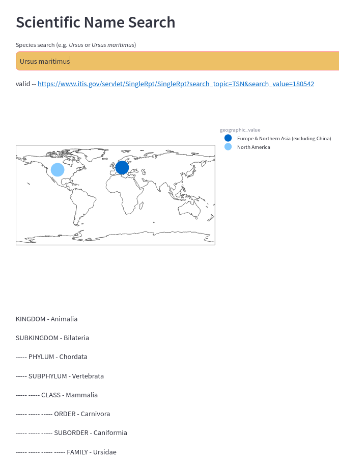

= ITIS Data Dash

Simple dashboard of taxonomic data sourced from ITIS <<1>> that provides:
    - exportable taxonomy data table
    - quick search nomenclature for validity
Dashboard <<2>>: https://itis-taxonomy-search.streamlit.app/

== Usage

=== Dashboard

=== Data
*Note - ITIS database does not exist in this repository, download ITIS data from source below.* 

Extract data from ITIS SQLite db  
- run src/script1-species.sql to dump data for all species as tsv to __itisdata/species.txt__  
- run src/script1-subspecies.sql to dump data for all species as tsv to __itisdata/subspecies.txt__
- run src/script2-species.sql to dump data for all taxa hierarchy as csv to __itisdata/taxa-species.csv__  
- run src/script2-subspecies.sql to dump data for all taxa hierarchy as csv to __itisdata/taxa-subspecies.csv__  

Parsing assumes 2 files above- 
[source,bash]
----
perl src/itis_parser.pl 
----

Dashboard -
[source,bash]
----
streamlit run itis_dash.py
----

== References
* [[[1]]] Retrieved from the Integrated Taxonomic Information System (ITIS) on-line database, www.itis.gov, CC0
https://doi.org/10.5066/F7KH0KBK  
* [[[2]]] Built on Streamlit - https://streamlit.io/

== Maintainers
The Conservation Technology Lab at the San Diego Zoo Wildlife Alliance
